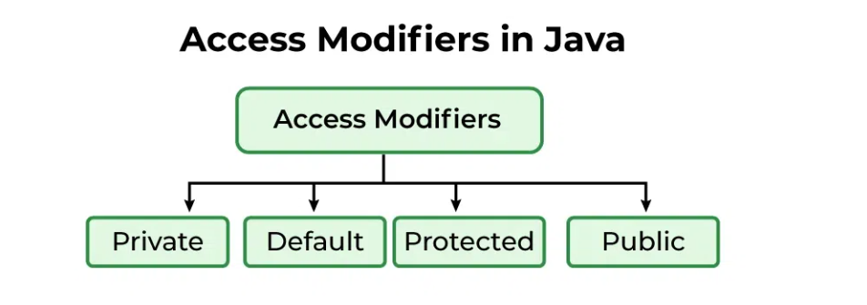
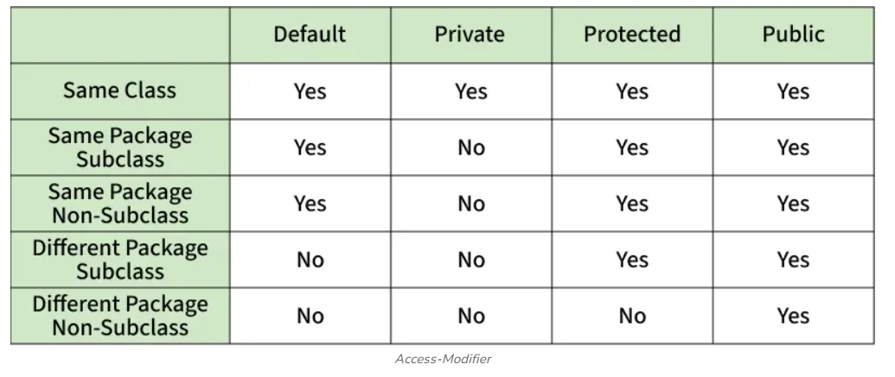

## Access Modifier
access modifiers are essential tools that define how the members of a class, like variables, methods, and even the class itself, can be accessed from other parts of our program.

## Private Access Modifier
The private access modifier is specified using the keyword private. The methods or data members declared as private are accessible only within the class in which they are declared.
~~~ java
class Person {

    // private variable
    private String name;

    public void setName(String name)  {

        this.name = name; // accessible within class
    }

    public String getName() { return name; }
}

public class Geeks {
    public static void main(String[] args)
    {

        Person p = new Person();
        p.setName("Alice");

        // System.out.println(p.name); // Error: 'name'
        // has private access
        System.out.println(p.getName());
    }
}
~~~
---
## Default Access Modifier
When no access modifier is specified for a class, method, or data member, it is said to have the default access modifier by default. This means only classes within the same package can access it.
~~~
java
class Car {
    String model; // default access
}

public class Main {
    
    public static void main(String[] args){
        
        Car c = new Car();
        c.model = "Tesla"; // accessible within the same package
        System.out.println(c.model);
    }
}
~~~
---
## Protected Access Modifier
The protected access modifier is specified using the keyword protected. The methods or data members declared as protected are accessible within the same package or subclasses in different packages.
~~~
java
class Vehicle {
    protected int speed; // protected member
}

class Bike extends Vehicle {
    void setSpeed(int s)
    {
        speed = s; // accessible in subclass
    }

    int getSpeed()
    {
        return speed; // accessible in subclass
    }
}

public class Main {
    public static void main(String[] args){
        
        Bike b = new Bike();
        b.setSpeed(100);
        System.out.println("Access via subclass method: "
                           + b.getSpeed());

        Vehicle v = new Vehicle();
        System.out.println(v.speed);
    }
}
~~~
---
## Public Access Modifier
The public access modifier is specified using the keyword public. Public members are accessible from everywhere in the program. There is no restriction on the scope of public data members.
~~~
java
class MathUtils { 
    
    public static int add(int a, int b) {
        return a + b;
    }
}

public class Main {
    
    public static void main(String[] args) {
        
        System.out.println(MathUtils.add(5, 10)); // accessible anywhere
    }
}
~~~
---
## Comparison Table of Access Modifiers in Java

---
## When to Use Each Access Modifier in Real-World Projects
* **Private**: The idea should be use as restrictive access as possible, so private should be used as much as possible.
* **Default**: (Package-Private): Often used in package-scoped utilities or helper classes.
* **Protected**: Commonly used in inheritance-based designs like framework extensions.
* **Public**: This is used for API endpoints, service classes, or utility methods shared across different parts of an application.

