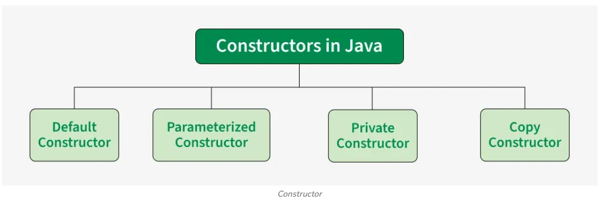

# Java Constructors
A constructor in Java is a special member that is called when an object is created. It initializes the new object’s state. It is used to set default or user-defined values for the object's attributes

* A constructor has the same name as the class.
* It does not have a return type, not even void.
* It can accept parameters to initialize object properties.
---
## Types of Constructors in Java

---
## Default Constructor
A default constructor has no parameters. It’s used to assign default values to an object. If no constructor is explicitly defined, Java provides a default constructor.
~~~
java
import java.io.*;

class Geeks{

    // Default Constructor
    Geeks(){
        
        System.out.println("Default constructor"); 
        
    }
    public static void main(String[] args){
        
        Geeks hello = new Geeks();
    }
}
~~~
---
## Parameterized Constructor
A constructor that has parameters is known as parameterized constructor. If we want to initialize fields of the class with our own values, then use a parameterized constructor.
~~~
java
class Geeks{

    // data members of the class
    String name;
    int id;

    // Parameterized Constructor
    Geeks(String name, int id)
    {
        this.name = name;
        this.id = id;
    }

    // Method to display object data
    void display(){
        
        System.out.println("GeekName: " + name
                           + " and GeekId: " + id);
    }

    // main() method — placed inside the same class for
    // universal compatibility
    public static void main(String[] args){
        
        // This will invoke the parameterized constructor
        Geeks geek1 = new Geeks("Sweta", 68);
        geek1.display();
    }
}
~~~
---
## Copy Constructor in Java
Unlike other constructors copy constructor is passed with another object which copies the data available from the passed object to the newly created object.
~~~
java
import java.io.*;

class Geeks{
    
    // data members of the class
    String name;
    int id;

    // Parameterized Constructor
    Geeks(String name, int id)
    {
        this.name = name;
        this.id = id;
    }

    // Copy Constructor
    Geeks(Geeks obj2)
    {
        this.name = obj2.name;
        this.id = obj2.id;
    }
}

class GFG {
    public static void main(String[] args)
    {
        // This would invoke the parameterized constructor
        System.out.println("First Object");
        Geeks geek1 = new Geeks("Sweta", 68);
        System.out.println("GeekName: " + geek1.name
                           + " and GeekId: " + geek1.id);

        System.out.println();

        // This would invoke the copy constructor
        Geeks geek2 = new Geeks(geek1);
        System.out.println(
            "Copy Constructor used Second Object");
        System.out.println("GeekName: " + geek2.name
                           + " and GeekId: " + geek2.id);
    }
}
~~~
---
## Private Constructor
A private constructor cannot be accessed from outside the class. It is commonly used in:

* **Singleton Pattern**: To ensure only one instance of a class is created.
* **Utility/Helper Classes**: To prevent instantiation of a class containing only static methods.

---
## Constructor Overloading
This is a key concept in OOP related to constructors is constructor overloading. This allows us to create multiple constructors in the same class with different parameter lists.
---
[Computer Networks][https://dev.to/guptem/my-computer-networks-journey-from-confusion-to-clarity-with-kunal-kushwaha-320b]
