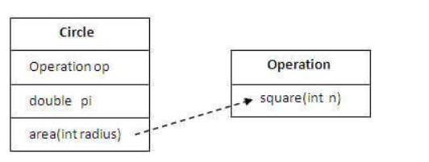

## Aggregation in Java
If a class have an entity reference, it is known as Aggregation. Aggregation represents HAS-A relationship.
~~~
class Employee{  
int id;  
String name;  
Address address;//Address is a class  
...  
}  
~~~
## Why use Aggregation?
For Code Reusability.
## Simple Example of Aggregation
