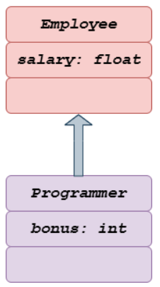
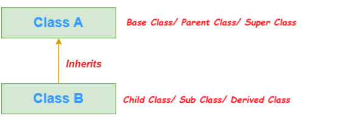
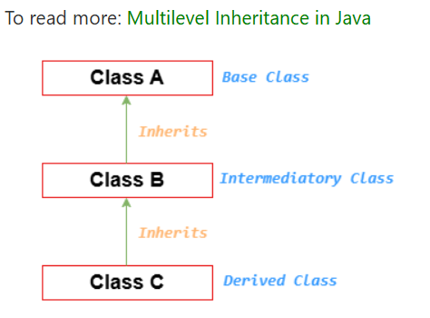
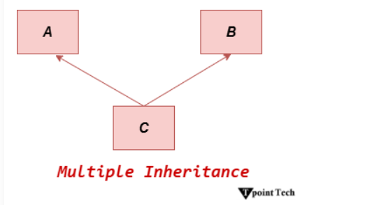
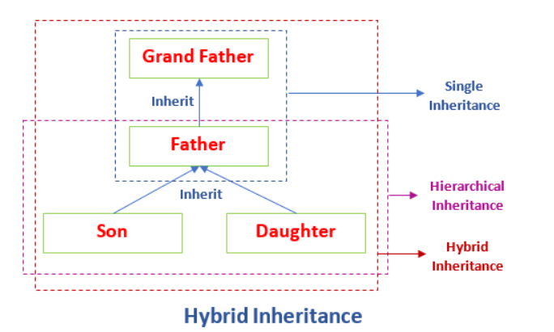

## What is Inheritance?
Inheritance in Java enables a class to inherit properties and actions from another class, called a superclass or parent class. A class derived from a superclass is called a subclass or child group. Through inheritance, a subclass can access members of its superclass (fields and methods), enforce reuse rules, and encourage hierarchy.

Inheritance represents the IS-A relationship which is also known as a parent-child relationship.

## Why use inheritance?
* For Method Overriding (so runtime polymorphism can be achieved).
* For Code Reusability.

### Terms used in Inheritance
* **Class**: A class is a group of objects which have common properties. It is a template or blueprint from which objects are created.
* **Sub Class/Child Class**: Subclass is a class which inherits the other class. It is also called a derived class, extended class, or child class.
* **Super Class/Parent Class**: Superclass is the class from where a subclass inherits the features. It is also called a base class or a parent class.
* **Reusability**: As the name specifies, reusability is a mechanism which facilitates you to reuse the fields and methods of the existing class when you create a new class. You can use the same fields and methods already defined in the previous class.

## Syntax of Inheritance
~~~
class A extends B{}
~~~
## flow Diagram 

## Code Examples
~~~
class Employee{  
 float salary=40000;  
}  
class Programmer extends Employee{  
 int bonus=10000;  
}  
public class Main{  
 public static void main(String args[]){  
   Programmer p=new Programmer();  
   System.out.println("Programmer salary is:"+p.salary);  
   System.out.println("Bonus of Programmer is:"+p.bonus);  
}  
}  
~~~
---
## Types of Inheritance in Java
On the basis of class, there can be three types of inheritance in java: single, multilevel and hierarchical.

In Java programming, multiple and hybrid inheritance is supported through interface only

## Single Inheritance
When a class inherits another class, it is known as a single inheritance. In the example given below, Dog class inherits the Animal class, so there is the single inheritance.

~~~
class Animal{  
void eat(){System.out.println("eating...");}  
}  
class Dog extends Animal{  
void bark(){System.out.println("barking...");}  
}  
public class Main{  
public static void main(String args[]){  
Dog d=new Dog();  
d.bark();  
d.eat();  
}}  
~~~
---
## Multilevel Inheritance
When there is a chain of inheritance, it is known as multilevel inheritance. As you can see in the example given below, BabyDog class inherits the Dog class which again inherits the Animal class, so there is a multilevel inheritance.

~~~
class Animal{  
void eat(){System.out.println("eating...");}  
}  
class Dog extends Animal{  
void bark(){System.out.println("barking...");}  
}  
class BabyDog extends Dog{  
void weep(){System.out.println("weeping...");}  
}  
public class Main{  
public static void main(String args[]){  
BabyDog d=new BabyDog();  
d.weep();  
d.bark();  
d.eat();  
}}  
~~~
---
## Hierarchical Inheritance
When two or more classes inherits a single class, it is known as hierarchical inheritance. In the example given below, Dog and Cat classes inherits the Animal class, so there is hierarchical inheritance.

~~~
class Animal{  
void eat(){System.out.println("eating...");}  
}  
class Dog extends Animal{  
void bark(){System.out.println("barking...");}  
}  
class Cat extends Animal{  
void meow(){System.out.println("meowing...");}  
}  
public class Main{  
public static void main(String args[]){  
Cat c=new Cat();  
c.meow();  
c.eat();  
//c.bark();//C.T.Error  
}}  
~~~
---
## Multiple Inheritance
* Multiple Inheritance A class's capacity to inherit traits from several classes is referred to as multiple inheritances. This notion may be quite helpful when a class needs features from many sources.
* Multiple inheritances, however, can result in issues like the diamond problem, which occurs when two superclasses share the same method or field and causes conflicts. Java uses interfaces to implement multiple inheritances in order to prevent these conflicts.

~~~
interface Character {    
    void attack();    
}    
interface Weapon {    
    void use();    
}    
class Warrior implements Character, Weapon {    
    public void attack() {    
        System.out.println("Warrior attacks with a sword.");    
    }    
    public void use() {    
        System.out.println("Warrior uses a sword.");    
    }    
}    
class Mage implements Character, Weapon {    
    public void attack() {    
        System.out.println("Mage attacks with a wand.");    
    }    
    public void use() {    
        System.out.println("Mage uses a wand.");    
    }    
}    
public class Main {    
    public static void main(String[] args) {    
        Warrior warrior = new Warrior();    
        Mage mage = new Mage();    
        warrior.attack(); // Output: Warrior attacks with a sword.    
        warrior.use(); // Output: Warrior uses a sword.    
        mage.attack(); // Output: Mage attacks with a wand.    
        mage.use(); // Output: Mage uses a wand.    
    }    
}    
~~~
---
## Hybrid Inheritance 
The hybrid inheritance is the composition of two or more types of inheritance. The main purpose of using hybrid inheritance is to modularize the code into well-defined classes. It also provides the code reusability.

The hybrid inheritance can be achieved by using the following combinations:
* Single and Multiple Inheritance (not supported but can be achieved through interface)
* Multilevel and Hierarchical Inheritance
* Hierarchical and Single Inheritance
* Multiple and Multilevel Inheritance
~~~
class C    
{    
public void disp()    
{    
System.out.println("C");    
}    
}    
class A extends C    
{    
public void disp()    
{    
System.out.println("A");    
}    
}    
class B extends C    
{    
public void disp()    
{    
System.out.println("B");    
}       
}    
public class D extends A    
{    
public void disp()    
{    
System.out.println("D");    
}    
public static void main(String args[])    
{    
D obj = new D();    
obj.disp();    
}    
}    
~~~
---
## Why multiple inheritance is not supported in Java?
To reduce the complexity and simplify the language, multiple inheritance is not supported in Java.

Suppose there are three classes A, B, and C. The C class inherits A and B classes. If A and B classes have the same method and we call it from child class object, there will be ambiguity to call the method of A or B class. It is called diamond problem.

To read more Diamond Problem in Java

Since compile-time errors are better than runtime errors, Java renders compile-time error if you inherit 2 classes. So, whether you have same method or different, there will be compile time error.
~~~
class A{
    public void display(){
        System.out.println("A");
    }
}
class B{
    public void display(){
        System.out.println("B");
    }
}
public class Multiple extends A B{
    public static void main(String[] args) {
        Multiple multiple =new Multiple();
        multiple.display();
    }
}
~~~
---
## Advantages of Inheritance
Inheritance offers several advantages, including:

* **Code Reusability**: Inherited members from a superclass can be reused in subclasses, reducing redundant code and promoting a modular approach to software development.

* **Hierarchical Organization**: Inheritance facilitates the creation of well-structured class hierarchies, improving code readability and maintainability.

* **Polymorphism**: Subclasses can override superclass methods, allowing for polymorphic behavior, where methods can behave differently based on the object type at runtime.

* **Easier Maintenance**: Changes made to a superclass automatically propagate to its subclasses, ensuring consistency and simplifying maintenance efforts.
---
## Best Practices for Using Inheritance
* While inheritance is a powerful tool, its misuse can lead to code complexity and tight coupling. Here are some best practices to consider:

* Favor Composition Over Inheritance: When possible, prefer composition, where classes are composed of other classes, over inheritance. This approach often leads to more flexible and maintainable code.

* Follow the "is-a" Relationship: Ensure that inheritance relationships adhere to the "is-a" principle, where a subclass represents a more specialized version of its superclass.

* Use Abstract Classes and Interfaces Wisely: Abstract classes and interfaces provide blueprints for subclasses. Use abstract classes when you want to provide a default implementation or share code among related subclasses. Use interfaces to define contracts that classes can implement, enabling multiple inheritance through interfaces.

* Avoid Deep Inheritance Hierarchies: Deep inheritance hierarchies can make code difficult to understand and maintain. Aim for shallow hierarchies whenever possible.

* Prefer Composition for Code Reuse: Instead of relying solely on inheritance for code reuse, consider using composition alongside inheritance to achieve better flexibility and modularity.

---