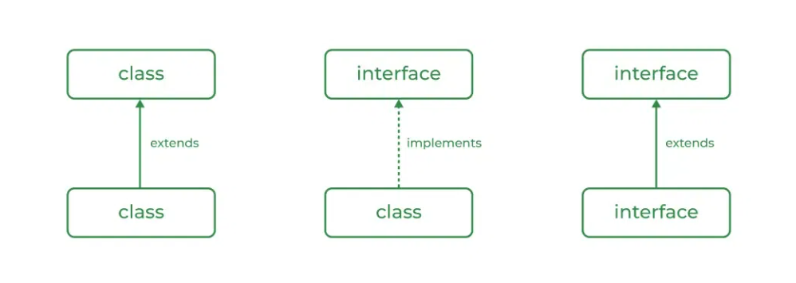
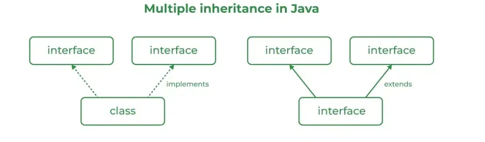

## Java Interface
An Interface in Java is an abstract type that defines a set of methods a class must implement.

* An interface acts as a contract that specifies what a class should do, but not how it should do it. It is used to achieve abstraction and multiple inheritance in Java. We define interfaces for capabilities (e.g. Comparable, Serializable, Drawable).
* A class that implements an interface must implement all the methods of the interface. Only variables are public static final by default.
* Prior to Java 8, interfaces could only have abstract methods (no bodies). Since Java 8, they can also include default and static methods (with implementation), and since Java 9, private methods are allowed.

## Relationship Between Class and Interface
A class can extend another class and similarly, an interface can extend another interface. However, only a class can implement an interface and the reverse (an interface implementing a class) is not allowed.

---
## Multiple Inheritance in Java Using Interface
Java does not support multiple inheritance with classes to avoid ambiguity, but it supports multiple inheritance using interfaces.

---
## Static Methods
Interfaces can now include static methods.
These methods are called directly using the interface name and are not inherited by implementing classes.
Another feature that was added in JDK 8 is that we can now define static methods in interfaces that can be called independently without an object. These methods are not inherited.
---
## Functional Interface
* Functional interfaces can be used with lambda expressions or method references.
* The @FunctionalInterface annotation can be used to indicate that an interface is a functional interface, although it’s optional.
~~~
java 
@FunctionalInterface
public interface Calculator {
    int compute(int x, int y); // single abstract method
}
~~~ 
---
## Private Methods
* Interface can now include private methods.
* Private methods are defined within the interface but it cannot be accessed by the implementing classes.
* Private methods cannot be overridden by implementing classes as they are not inherited
~~~
java
interface Vehicles {
    // Private method for internal use
    private void startEngine() {
        System.out.println("Engine started.");
    }
    
    // Default method that uses the private method
    default void drive() {
         // Calls the private method
        startEngine(); 
        System.out.println("Vehicles is now driving.");
    }
}

class Car implements Vehicles {
    // Car class implements Vehicles interface and inherits the default method 'drive'
}

public class Main {
    public static void main(String[] args) {
        Car car = new Car();
        // This will call the default method, which in turn calls the private method
        car.drive();  
    }
}
~~~
---
## Extending Interfaces
One interface can inherit another by the use of keyword extends. When a class implements an interface that inherits another interface, it must provide an implementation for all methods required by the interface inheritance chain.
~~~
java
interface A {
    void method1();
    void method2();
}

// B now includes method1 and method2
interface B extends A {
    void method3();
}

// the class must implement all method of A and B.
class GFG implements B 
{
    public void method1() {
        System.out.println("Method 1");
    }
  
    public void method2() {
        System.out.println("Method 2");
    }
  
    public void method3() {
        System.out.println("Method 3");
    }
  
  	public static void main(String[] args){
      	
      	// Instance of GFG class created
      	GFG x = new GFG();
      	
      	// All Methods Called
      	x.method1();
      	x.method2();
      	x.method3();
    }
}
~~~