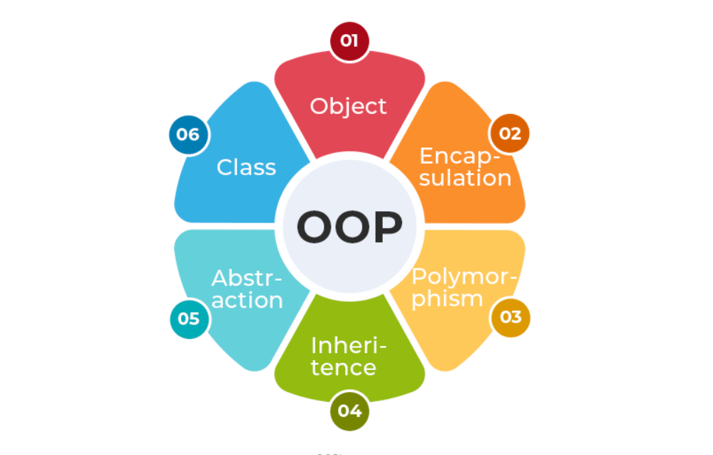

# Object Orientation Programming

## why we using oops ? 
* Before Object-Oriented Programming (OOPs), most programs used a procedural approach, where the focus was on writing step-by-step functions. This made it harder to manage and reuse code in large applications.
* To overcome these limitations, Object-Oriented Programming was introduced. Java is built around OOPs, which helps in organizing code using classes and objects.
---

## characteristics of OOPS

---

## class
A Class is a user-defined blueprint or prototype from which objects are created. It represents the set of properties or methods that are common to all objects of one type. Using classes, you can create multiple objects with the same behavior instead of writing their code multiple times. In general, class declarations can include these components in order:

* Modifiers: A class can be public or have default access (Refer to this for details).
* Class name: The class name should begin with the initial letter capitalized by convention.
* Body: The class body is surrounded by braces, { }.

---

## Object
An Object is a basic unit of Object-Oriented Programming that represents real-life entities. A typical Java program creates many objects, which as you know, interact by invoking methods. The objects are what perform your code, they are the part of your code visible to the viewer/user. An object mainly consists of:

* State: It is represented by the attributes of an object. It also reflects the properties of an object.
* Behavior: It is represented by the methods of an object. It also reflects the response of an object to other objects.
* Identity: It is a unique name given to an object that enables it to interact with other objects.
* Method: A method is a collection of statements that perform some specific task and return the result to the caller.

---
## Abstraction
Abstraction in Java is the process of hiding the implementation details and only showing the essential details or features to the user. It allows to focus on what an object does rather than how it does it. The unnecessary details are not displayed to the user.
---
## Encapsulation
Encapsulation is defined as the process of wrapping data and the methods into a single unit, typically a class. It is the mechanism that binds together the code and the data. It manipulates. Another way to think about encapsulation is that it is a protective shield that prevents the data from being accessed by the code outside this shield.

* Technically, in encapsulation, the variables or the data in a class is hidden from any other class and can be accessed only through any member function of the class in which they are declared.
* In encapsulation, the data in a class is hidden from other classes, which is similar to what data-hiding does. So, the terms "encapsulation" and "data-hiding" are used interchangeably.
* Encapsulation can be achieved by declaring all the variables in a class as private and writing public methods in the class to set and get the values of the variables.

---
## Inheritance
Inheritance is an important pillar of OOP (Object Oriented Programming). It is the mechanism in Java by which one class is allowed to inherit the features (fields and methods) of another class. We are achieving inheritance by using extends keyword. Inheritance is also known as "is-a" relationship.

**Example**: Dog, Cat, Cow can be Derived Class of Animal Base Class. 
## polymorphism
The word polymorphism means having many forms, and it comes from the Greek words poly (many) and morph (forms), this means one entity can take many forms. In Java, polymorphism allows the same method or object to behave differently based on the context, specially on the project's actual runtime class.

**Types of Polymorphism**
Polymorphism in Java is mainly of 2 types as mentioned below:

* Method Overloading
* Method Overriding 

**Method Overloading**: Also, known as compile-time polymorphism, is the concept of Polymorphism where more than one method share the same name with different signature(Parameters) in a class. The return type of these methods can or cannot be same.

**Method Overriding**: Also, known as run-time polymorphism, is the concept of Polymorphism where method in the child class has the same name, return-type and parameters as in parent class. The child class provides the implementation in the method already written.
